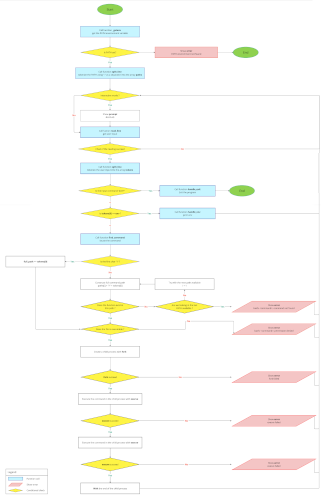

# Simple Shell

## 📜 Table of Contents

- [Description](#-description)
- [Features](#-features)
- [Requirements](#-requirements)
- [Installation](#-installation)
- [Flowchart](#-flowchart)
- [File Structure](#-file-structure)
- [Man page](#-man-page)
- [Examples](#-examples)
- [Licence](#-license)
- [Authors](#-authors)

## ✨ Description

`simple_shell` is a minimalistic implementation of a Unix shell, written in C. This project was developed as part of the Holberton School curriculum to deepen understanding of system programming concepts like:

- **Command execution**
- **Environment variables**
- **Interactive and non-interactive modes**

The shell reads user input, searches for the specified commands, and executes them. It supports both **interactive mode** (with a prompt) and **non-interactive mode** (via piping or redirection).

## 🎯 Features

- **Execute system commands**: Supports Unix commands like `ls`, `pwd`, and `echo`.
- **Command search**: Finds commands in directories specified by the `PATH` environment variable.
- **Environment variable handling**: Reads and uses the `PATH` variable.
- **Support for absolute and relative paths**: Executes commands using their full path or command name (if found in `PATH`).
- **Error handling**: Displays errors for commands that cannot be found or executed.
- **Built-in commands**:
  - `exit`: Exits the shell.
  - `env`: Displays the current environment variables.

## 🛠️ Requirements

- Ubuntu 20.04 LTS
- GCC compiler with flags:
  ```
  -Wall -Werror -Wextra -pedantic -std=gnu89
  ```
- Standard C libraries

## 📦 Installation

To set up and run the `simple_shell` program:

### Clone the repository
If you haven’t already, clone the repository:
```bash
git clone https://github.com/alexandremorin24/holbertonschool-simple_shell
```
Then:
```bash
cd simple_shell
```

### Compilation
Compile the project using:
```bash
gcc -Wall -Werror -Wextra -pedantic -std=gnu89 *.c -o hsh
```

## 📘 Usage
Run the shell in **interactive mode**:
```bash
./hsh
```
The prompt `#cisfun$` will appear, waiting for your input.

Or, run it in **non-interactive mode**, for example:
```bash
echo "ls -l" | ./hsh
```

### Exiting the shell
To exit, use the `exit` command:
```bash
exit
```

## 🧩 Flowchart

[](flowchart.png)

## 📂 File Structure

The project consists of the following files:

| File                | Description                                                   |
|---------------------|---------------------------------------------------------------|
| `shell.c`           | Main file with the shell loop and execution logic.             |
| `shell.h`           | Header file containing function prototypes and includes.      |
| `split_line.c`      | Tokenizes input into command arguments.                       |
| `find_command.c`    | Searches for commands in the `PATH`.                          |
| `execute.c`         | Executes commands using `execve`.                             |
| `process_command.c` | Processes commands and handles built-ins.                     |
| `input.c`           | Reads user input.                                             |
| `built_in.c`        | Implements built-in commands like `exit` and `env`.           |
| `helpers.c`         | Helper functions, including `_realloc` and `print_env`.       |
| `man_1_simple_shell`| Manual page for the shell.                                    |
| `README.md`         | Documentation for the project.                                |

## 📖 Man page

A man page is available for the `_printf` function. To view it, run:

```bash
man ./man_1_simple_shell
```

## ✅ Testing

You can test the shell by writing test scripts or using `valgrind` to check for memory leaks:

### Example Test
Create a test script:
```bash
echo "ls -l" | ./hsh
echo "pwd" | ./hsh
```
Run it:
```bash
./test_script.sh
```

### Memory Leak Checks
Use `valgrind` to check for memory leaks:
```bash
valgrind --leak-check=full ./hsh
```
```
==12345== HEAP SUMMARY:
==12345== in use at exit: 0 bytes in 0 blocks
==12345== All heap blocks were freed -- no leaks are possible
```

## ✅ Examples

### Example 1: Listing files in the current directory
```bash
#cisfun$ ls -l
total 176
-rw-r--r--@ 1 root  staff      8  4 jan 11:07 AUTHORS
drwxr-xr-x@ 5 root  staff    160  6 jan 09:41 Concept
-rw-r--r--@ 1 root  staff   4392  8 jan 09:19 README.md
```

### Example 2: Running a command with an absolute path
```bash
#cisfun$ /bin/echo "Hello, World"
Hello, World
```

### Example 3: Command not found
```bash
#cisfun$ nonexistent_command
bash: nonexistent_command: command not found
```

## ⚠️ Limitations

- Does not support advanced shell features like piping (`|`) or redirection (`>` and `<`).
- Limited built-in commands (`exit`, `env` only).
- No support for command history or tab-completion.
- Error messages may not cover all edge cases (e.g., malformed input).
- Non-compliance with certain advanced POSIX standards.

## 🔑 License

This project is open-source and available for free use and distribution under the MIT License.

## 👨‍💻 Authors

- **Alexandre MORIN**  
  - [GitHub](https://github.com/alexandremorin24) | [Email](mailto:alexandre.morin24@gmail.com)

- **Nicolas LASSOUANE**  
  - [GitHub](https://github.com/) | [Email](mailto:9820@holbertonstudents.com)
